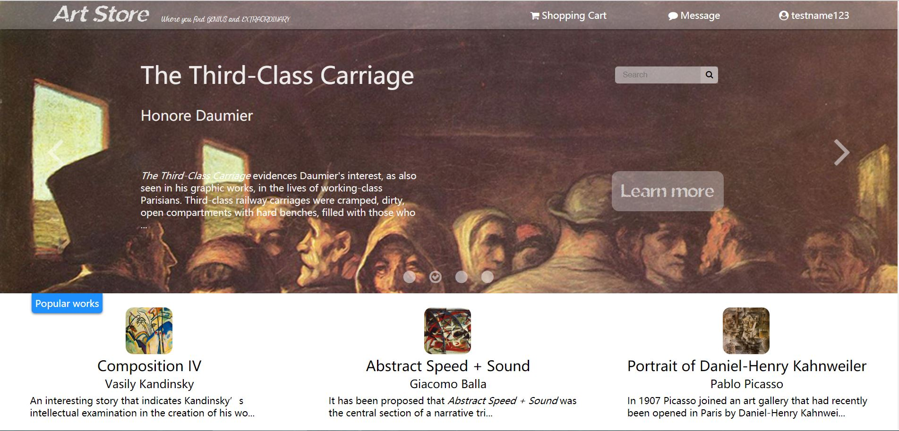
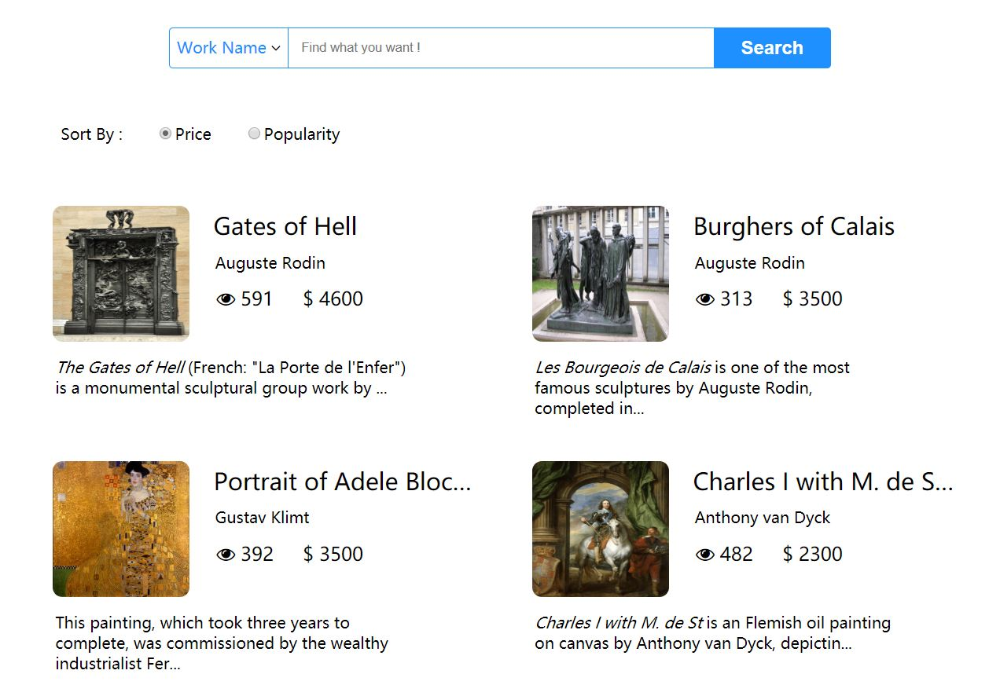
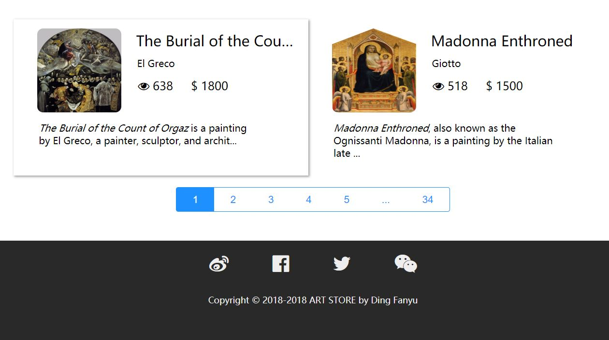

# Art-Store
### 概述：

这是一个朴（jian）素（lou）的艺术品交易网站project。

用户首先进入网站主页，此时他可以自由搜索、浏览网站内的各艺术品信息，但不能进行购买、发布等操作。用户进入注册页面，注册登录成功后即成为网站的正式用户，可以使用网站的全部功能。一旦注册，此后用户再次访问该网站时只需登录即可。

已登录的用户在浏览艺术品时可将其添加到自己的购物车，之后在购物车页面完成正式的下单购买。用户首先应在个人页面对其余额进行充值，只有余额足够才能购买成功。

除了购买艺术品，已登录的用户也可以前往发布页面发布新的艺术品，新的艺术品一经发布即可在网站上被任何用户搜索/查看到，并可以被其他用户购买。其他用户成功购买该艺术品后，购买人所支付的费用会直接转入发布人的余额中。

### 预览：

* #### 主页

  

* #### 详情页

  

* #### 搜索页

  

  

* #### 个人页面

  

  

* #### 购物车

  

  > 购物车中的临时垃圾桶功能存在bug，暂未修复。

* #### 艺术品发布

  

  

* #### 艺术品修改

  
